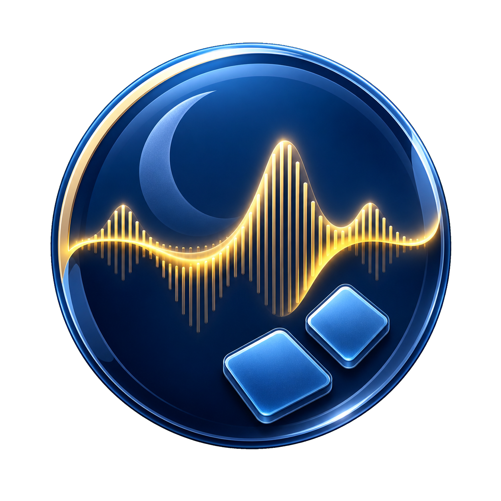

<p align="center">
  
</p>

<h1 align="center">LiveAudioBoard</h1>

<p align="center">A local Windows sound library, soundboard, and dual-bus mixer for live streaming.</p>

<p align="center">
  <a href="https://github.com/2683445453/live-audio-board/actions/workflows/ci.yml"></a>
  <a href="https://github.com/2683445453/live-audio-board/releases/latest"></a>
  
  
  <a href="LICENSE"></a>
</p>

<p align="center">
  <a href="README.md">简体中文</a> · English ·
  <a href="https://github.com/2683445453/live-audio-board/releases/latest">Download</a> ·
  <a href="docs/USER_GUIDE.md">User guide (Chinese)</a> ·
  <a href="CHANGELOG.md">Changelog</a>
</p>

> [!IMPORTANT]
> LiveAudioBoard is source-available for personal and noncommercial use. Commercial use is not
> permitted without a separate license. It is **not OSI-approved open-source software**. See
> [Commercial Licensing](COMMERCIAL_LICENSE.md) before using it for monetized streams, paid services,
> business operations, resale, or client work.

## Highlights

- Managed SQLite audio library with folder import, drag and drop, categories, favorites, search,
  paging, content-addressed storage, SHA-256 deduplication, backups, and missing-file recovery.
- NAudio/WASAPI multi-sound mixing with independent live and monitor buses, global hotkeys, looping,
  exclusive playback, fades, trim points, cooldown, and emergency stop.
- EBU R128-style loudness analysis, suggested gain, per-clip protection, and a final `-1 dBFS` bus
  limiter with a live meter.
- Microphone and Windows loopback recording plus non-destructive WAV, MP3, and M4A export.
- In-app Openverse, Internet Archive, RSS/Atom, and Freesound OAuth2 discovery and downloads.
- Three concurrent background downloads, per-item cancellation, safe HTTP range resume, attribution
  metadata, and automatic library import.
- Self-contained .NET 10 `win-x64` releases with Velopack Setup, MSI, portable packages, and updates.

## Install

Download the latest files from [GitHub Releases](https://github.com/2683445453/live-audio-board/releases/latest):

- `LiveAudioBoard-win-Setup.exe` for a per-user installation and in-app updates;
- `LiveAudioBoard-win.msi` for a conventional Windows deployment;
- `LiveAudioBoard-*-win-x64-portable.zip` for a no-install copy.

The release is self-contained. Unsigned builds may show a Windows SmartScreen warning. Download only
from this repository and verify the file against `SHA256SUMS.txt` on the same release page.

## Build

Windows 10/11 x64 and .NET SDK 10.0.302 are required.

```powershell
dotnet restore LiveAudioBoard.sln
dotnet build LiveAudioBoard.sln --configuration Release --no-restore
dotnet test LiveAudioBoard.sln --configuration Release --no-build --no-restore
./scripts/build-release.ps1 -Version 0.22.0
```

Runtime data stays in `%LOCALAPPDATA%\LiveAudioBoard` and is not uploaded automatically. Freesound
credentials are encrypted for the current Windows user with DPAPI.

## Licensing

LiveAudioBoard is licensed under the
[PolyForm Noncommercial License 1.0.0](LICENSE). It permits personal and qualifying noncommercial use,
modification, and redistribution. A separate commercial license is required for commercial use.
Third-party dependencies keep their own licenses, and downloaded audio remains subject to its own
copyright and platform terms.

Required Notice: Copyright (c) 2026 2683445453.
